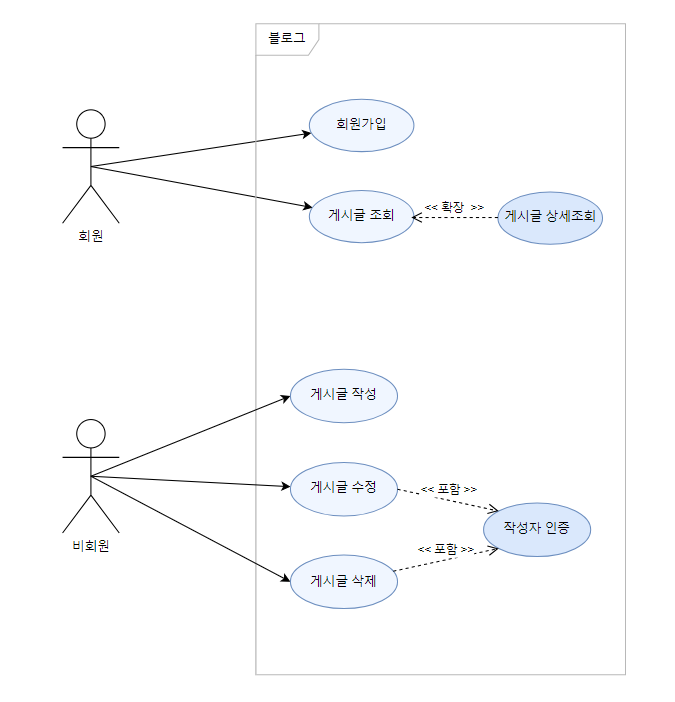
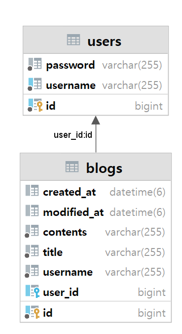
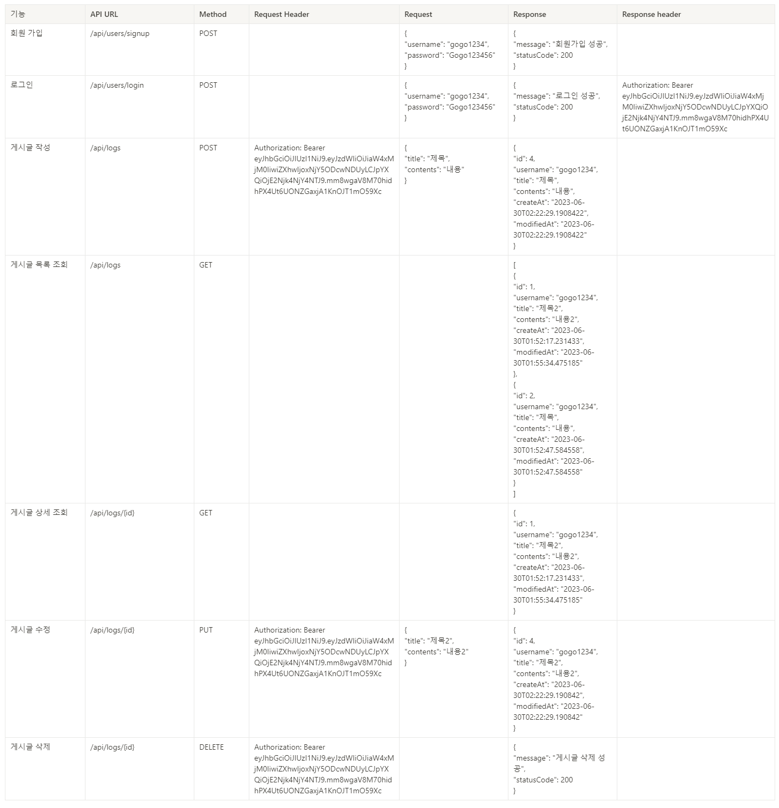

# SPRING.V2
"회원가입, 로그인 기능이 추가된 나만의 블로그 백엔드 서버 만들기"

[Notion 바로가기](https://www.notion.so/verdureko/Spring-Lv-2-56f847ca73f34fd691bbc29659018c0a)

## Use Case

   

## ERD

   

## API 명세서

   

1. 처음 설계한 API 명세서에 변경사항이 있었나요?
   변경 되었다면 어떤 점 때문 일까요? 첫 설계의 중요성에 대해 작성해 주세요! 
- 튜터님이 알려주신 API URL 컨벤션에 따라 단수에서 복수로 변경하여 차후 엔티티를 추가 하더라도 유연하도록 하였습니다.
2. ERD를 먼저 설계한 후 Entity를 개발했을 때 어떤 점이 도움이 되셨나요?
- 관계형 구조를 표현할 수 있는데 장점이 있는것 같지만 😢 이해를 못해 장점을 설명하기 어렵습니다. 복습을 통해 장점을 파악할 수 있도록 하겠습니다.
3. JWT를 사용하여 인증/인가를 구현 했을 때의 장점은 무엇일까요?
- 인증을 위한 별도의 저장소가 요구되지않아 빠른 인증처리, 확장성이 우수함
4. 반대로 JWT를 사용한 인증/인가의 한계점은 무엇일까요?
- 외부에서 접근하기 쉽고 노출 가능성으로 인해 저장할 수 있는 정보가 제한적이다
5. 만약 댓글 기능이 있는 블로그에서 댓글이 달려있는 게시글을 삭제하려고 한다면 무슨 문제가 발생할까요? Database 테이블 관점에서 해결방법이 무엇일까요?
- 외래키나 제약조건을 먼저 삭제 후 삭제합니다.
6. IoC / DI 에 대해 간략하게 설명해 주세요!
- 제어의 역전과 의존성 주입은 클래스 간의 느슨한 결합으로 코드의 유지보수 및 재활용을 용이하게 하는데 목적이 있습니다. 
